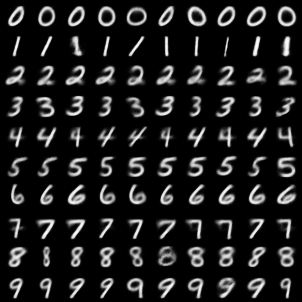
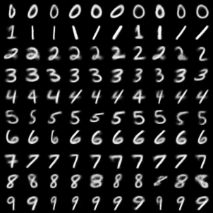
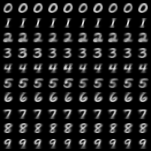
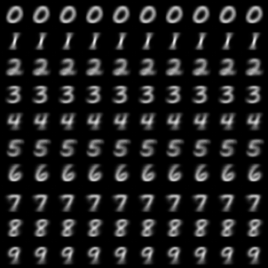

This repository contains CVAE and CVQVAE implementations in PyTorch for MNIST dataset.

### Run

```bash
pip install -r requirements.txt
python main.py --latent_size 2 --batch_size 64
```

The model will be evaluated after every epoch. You can check the images generated by the decoder in the `images` folder.

When the training finishes, the model will be saved to `model.pth`.

There are two types of encoders and decoders: `mlp` and `conv`. You can use one of them by passing the `--encoder` and `--decoder` options.

There are two types of CVAE: `cvae` and `cvqvae`. You can use one of them by passing the `--model_type` option.

Run `python main.py --help` for more help on options.

### ONNX

You can export the decoder to the ONNX format and play with it in an interactive way using `demo.html`

```bash
# The onnx model will be saved as decoder.onnx
python main.py --export_onnx --latent_size 2 --encoder mlp --decoder mlp --model_path model.pth
python -m http.server
# Now open http://localhost:8000/demo.html
```

Note that because `onnx.js` does not support the `ConvTranspose` operator, you can only export the MLP decoder.

The web page only supports 2-dim latent representation. Feel free to hack around it!

### Results

Below are some generated images. All models use 2-dim latent representations.

#### MLP+CVAE



#### Conv+CVAE



#### MLP+CVQVAE



#### Conv+CVQVAE

